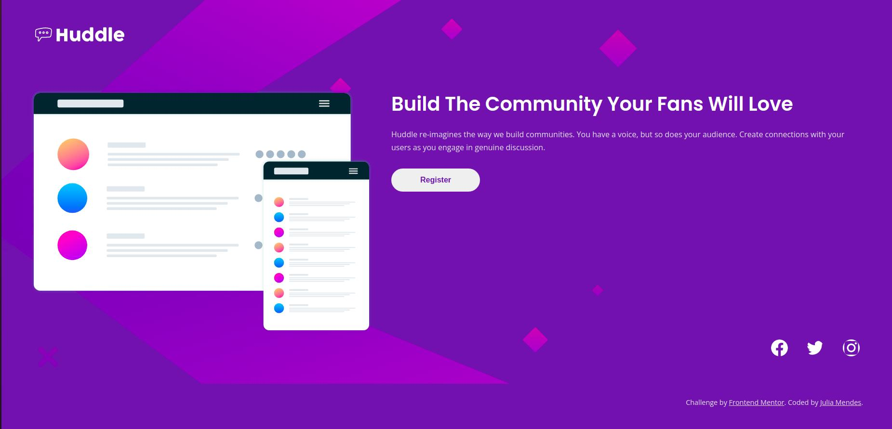

# Frontend Mentor - Huddle landing page with single introductory section solution

This is a solution to the [Huddle landing page with single introductory section challenge on Frontend Mentor](https://www.frontendmentor.io/challenges/huddle-landing-page-with-a-single-introductory-section-B_2Wvxgi0). Frontend Mentor challenges help you improve your coding skills by building realistic projects.

## Table of contents

- [Frontend Mentor - Huddle landing page with single introductory section solution](#frontend-mentor---huddle-landing-page-with-single-introductory-section-solution)
  - [Table of contents](#table-of-contents)
  - [Overview](#overview)
    - [The challenge](#the-challenge)
    - [Screenshot](#screenshot)
    - [Links](#links)
  - [My process](#my-process)
    - [Built with](#built-with)
    - [What I learned](#what-i-learned)
  - [Author](#author)
  - [Acknowledgments](#acknowledgments)

## Overview

### The challenge

Users should be able to:

- View the optimal layout for the page depending on their device's screen size
- See hover states for all interactive elements on the page

### Screenshot

### Links

- [Solution at Frontend Mentor](https://www.frontendmentor.io/solutions/responsive-html-css-solution-RWdFj7jJt)
- [Live Site](https://juliamendesc.github.io/Huddle-site-cloning/)

## My process

### Built with

- Semantic HTML5 markup
- CSS custom properties
- Flexbox
- Mobile-first workflow
### What I learned

This project was an opportunity to further study hsl color representations. For further study on this subject, a good starting point is [this page](https://en.wikipedia.org/wiki/HSL_and_HSV).

## Author

- LinkedIn - [@juliamendesc](https://www.linkedin.com/in/juliamendesc/)
- Frontend Mentor - [@juliamendesc](https://www.frontendmentor.io/profile/juliamendesc)

## Acknowledgments

Thanks to [Amrin](https://coderamrin.hashnode.dev/) for the useful tips!
